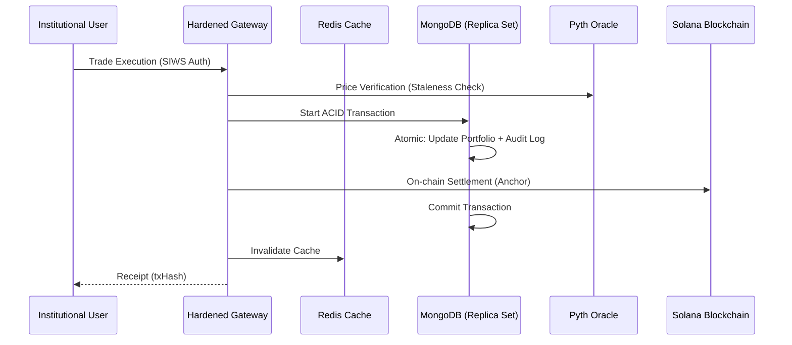

# AssetVerse — Institutional RWA Tokenization Platform

A production-hardened decentralized platform for fractional real-world asset ownership on **Solana**, featuring real-time oracles, atomic settlement, and institutional-grade observability.

  

---

## 🏛️ System Architecture

Our architecture is designed for 99.9% availability and absolute data consistency.



---

## 🛡️ Production Hardening Stack

The platform has undergone 6 phases of senior staff architectural hardening:

### 1. Security & Compliance
- **SIWS Protocol**: All sensitive routes are guarded by Solana Sign-In With Wallet signatures.
- **WAF Layer**: Rate limiting (Read/Write tiers) and NoSQL/ReDoS injection protection.
- **Audit Trails**: Immutable regulator-grade transaction logging synchronized with database sessions.

### 2. Market Intelligence
- **Live Oracles**: Integrated with **Pyth Hermes** for sub-second NAV pricing.
- **Circuit Breakers**: Graceful degradation logic implemented for oracle or RPC outages.

### 3. High-Performance Grid
- **60fps Rendering**: Virtualized asset lists for zero scroll stuttering.
- **Socket.io Sync**: Global `RealtimeContext` broadcasting platform events (Trades, TVL milestones) instantly.
- **Cache-Aside Architecture**: Multi-tier caching via Redis to offload main persistence.

### 4. Operational Resilience
- **Resource Guarding**: Docker containers configured with strict CPU/RAM limits and log rotation.
- **Deep Monitoring**: `/api/health` monitors 4 separate subsystems with real-time UI telemetry.
- **Graceful Termination**: Automated cleanup of persistent connections on node cycle.

---

## 🚀 Deployment Guide

### Staging Environment (Docker)
The entire institutional stack is containerized for instant local or cloud deployment.
```bash
# Build and start the hardened cluster
docker-compose up -d --build
```

### Quick Commands
| Task | Command |
|------|---------|
| **Seed Platform** | `docker-compose exec backend npm run seed` |
| **Run Load Test** | `node backend/scripts/load-test.js` |
| **Check Health** | `curl http://localhost:5000/api/health` |
| **View Audit** | `cat backend/logs/pino.log` |

---

## 📂 Institutional Documentation
For deep-dives into management and developer integration:
- 📑 [**API Specification**](docs/API_SPEC.md) — Technical reference for all endpoints.
- 🚨 [**Operations Playbook**](docs/OPERATIONS.md) — Incident response and maintenance.
- 🧪 [**Test Suite**](tests/) — Anchor integration test coverage.

---

## 🛠️ Technology Stack
- **Blockchain**: Solana (Anchor 0.30.1)
- **Data**: MongoDB (Replica Set), Redis (Cluster-ready)
- **Telemetry**: Pino Structured Logging
- **Logic**: Express.js (Hardened), Socket.io v4
- **UI**: Next.js 15 (Standalone Mode), Framer Motion, Recharts

---

## 📄 License
MIT License — Copyright (c) 2026 AssetVerse Foundation.
