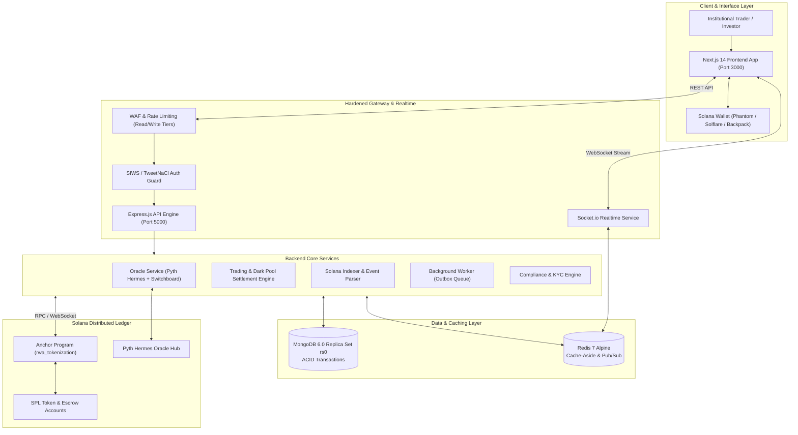

# AssetVerse — Institutional RWA Tokenization Platform
## Comprehensive Architecture & Technical System Report

**Date:** September 28, 2026  
**Platform Version:** `1.2.0-stable`  
**Network Target:** Solana Devnet / Testnet / Mainnet-Beta  
**Security Baseline:** Institutional Grade (Phase 6 Hardened)  
**Status:** 🟢 **Active & Operational**

---

## 1. Executive Summary

**AssetVerse** is an institutional-grade, full-stack decentralized finance platform engineered to tokenize and trade fractionalized **Real-World Assets (RWAs)** on the **Solana** blockchain. The platform bridges physical assets—including ultra-luxury residential properties, commercial towers, industrial logistics hubs, farmland, pre-IPO equity, sovereign debt pools, and vaulted precious metals—with high-throughput decentralized liquidity.

### Core Value Propositions
* **Sub-Second Settlement**: Sub-400ms transaction finality leveraging Solana's Proof-of-History (PoH) consensus and Anchor framework.
* **ACID Transaction Guarantees**: MongoDB 6.0 Replica Set (`rs0`) combined with an Outbox Dispatch pattern to guarantee consistency between off-chain balances and on-chain Anchor state.
* **Multi-Oracle Resilience**: Integrated Pyth Network (Hermes protocol) with secondary Switchboard oracle fallbacks and automated volatility circuit breakers.
* **Institutional Compliance**: SIWS (Sign-In With Solana) cryptographic authentication, automated KYC/AML tiering, accredited investor whitelists, and regulator-grade audit trails.
* **High-Frequency Realtime Grid**: WebSockets (Socket.io) backed by Redis Pub/Sub, streaming sub-second NAV pricing, orderbook updates, and portfolio telemetry directly to virtualized 60fps frontends.

---

## 2. High-Level System Architecture

The platform follows a resilient 4-tier architecture comprising on-chain smart contracts, off-chain reactive microservices, persistent transactional storage, and a responsive web application.



---

## 3. Blockchain & Smart Contract Layer (`programs/rwa-tokenization`)

The smart contract suite is written in **Rust** using the **Anchor 0.30.1** framework. It implements 33 modular instruction handlers and 18 account states.

### 3.1 Key State Accounts & PDAs
* **`Asset` Account**: Stores total supply, available supply, asset valuation, symbol, authority, verification hash, and metadata URI.
* **`UserOwnership` Account**: Tracks user token balances, accrued unclaimed yield, locked fractions, and compounding preferences.
* **`ProgramConfig` & `RoleRegistry`**: Super-admin, verifier, transfer-agent, and compliance officer role-based access control (RBAC).
* **`LiquidityPool` Account**: Automated Market Maker (AMM) pool state with constant-product bonding curves and fee reserve accounting.
* **`TradeOrder` Account**: Orderbook accounts supporting OTC limit orders, cancellations, and atomic escrow matches.
* **`RentVault` & `Treasury`**: Segregated on-chain treasuries for automated rental yield deposits and dividend dispersion.
* **`OracleCircuitBreaker`**: Circuit-breaker parameter state (max price deviation bps, staleness threshold in seconds, heartbeat timestamp).

### 3.2 Program Instructions Breakdown
1. **Lifecycle & Verification**:
   - `initialize_asset`: Deploys new RWA token metadata and initializes the SPL Mint authority.
   - `register_verifier` & `initiate_multi_verification`: Requires $M$-of-$N$ physical verification signatures before assets transition from `pending` to `active`.
   - `approve_tokenization`: Final compliance sign-off enabling minting and distribution.
2. **Trading & Fractional Exchange**:
   - `buy_shares` / `sell_shares`: Atomic fractional shares exchange with on-chain payment spl-token transfers.
   - `create_escrow`, `settle_escrow`, `refund_escrow`, `dispute_escrow`: OTC escrow settlement system for large institutional block orders.
   - `create_pool` / `swap_tokens`: Native AMM pools for 24/7 continuous liquidity.
3. **Dividend Yield & Rent Flow**:
   - `collect_rent`: Ingests fiat or stablecoin lease revenues into the `RentVault`.
   - `fund_yield` & `distribute_yield`: Computes pro-rata yield across active fraction holders.
   - `claim_yield` & `compound_yield`: Auto-compounding reinvestment into additional shares.
4. **Governance & Corporate Actions**:
   - `create_proposal`, `cast_vote`, `execute_proposal`: Shareholder governance with token-weighted voting thresholds.

---

## 4. Backend Micro-Architecture (`backend/`)

The backend is built with **Node.js / Express** and modular micro-services designed for high resilience and zero data loss.

### 4.1 Transaction Lifecycle & Outbox Pattern
To prevent distributed inconsistencies between off-chain database records and on-chain Solana transactions, the platform executes trades through an **Outbox Pattern**:
1. Client signs trading intent via SIWS.
2. Gateway initiates an ACID MongoDB multi-document session.
3. User balances and asset available supply are conditionally updated; an `OUTBOX_DISPATCH` task is atomically saved in the same transaction.
4. The transaction commits.
5. The `backgroundWorkerService` polls pending tasks, dispatches the on-chain Anchor transaction, and marks the task `COMPLETED` or `DEAD_LETTER`.

### 4.2 Multi-Oracle Feeds & Circuit Breakers (`oracleService.js`)
* **Primary Source**: Pyth Network Hermes HTTP / WebSocket stream.
* **Secondary Fallback**: Switchboard decentralized oracle aggregation.
* **Heartbeat & Circuit Breaker**: Runs continuous polling (configurable 5000ms). If price fluctuation exceeds $\pm 10\%$ within a single epoch or if oracles timeout, the circuit breaker trips into `halted` mode, suspending automated executions to protect investor capital.

### 4.3 Real-Time WebSocket Streaming (`realtimeService.js`)
* Integrated `Socket.io v4` backed by Redis pub/sub channels (`channel:trades`, `channel:prices`, `channel:alerts`).
* Broadcasts sub-second NAV recalculations, OTC limit order fills, and TVL milestone broadcasts without polling.

---

## 5. Persistent Data & Caching Topology

### 5.1 MongoDB 6.0 Replica Set (`rs0`)
* Configured with single-node replica set topology on port `27017` to enable MongoDB ACID Multi-Document Transactions.
* Persistent volume: `mongo-data`.
* Core collections: `assets`, `users`, `portfolios`, `transactions`, `liquiditypools`, `otcorders`, `governanceproposals`, `backgroundtasks`, `auditlogs`.

### 5.2 Redis 7 Alpine
* High-performance in-memory cache on port `6379`.
* Implements **Cache-Aside pattern**: frequently queried assets (`/api/assets`) and oracle prices are cached with short TTLs and invalidated on write transactions.
* Provides non-blocking fallbacks if Redis is momentarily degraded.

---

## 6. Frontend Web Architecture (`frontend/`)

Built on **Next.js 14 (App Router)** and **React 18** with Tailwind CSS, Framer Motion, and Recharts.

### 6.1 Layout & State Management
* **`WalletProvider`**: Full Solana wallet ecosystem support (Phantom, Solflare, Torus, Ledger) via `@solana/wallet-adapter-react`.
* **`AuthContext` & SIWS**: Handles Solana Sign-In With Wallet nonce challenge and JWT session lifecycle.
* **`RealtimeContext`**: Singleton WebSocket connection handling auto-reconnects, ping/pong health, and live state dissemination.
* **`CurrencyContext`**: Seamless multi-currency fiat & crypto conversion (USD, EUR, GBP, AED, INR, JPY, SOL).
* **`RoleContext`**: Role switcher allowing quick toggling between Institutional Investor, Property Manager, Verifier, and Compliance Officer modes.

### 6.2 Key Application Routes
| Route | Functionality |
| :--- | :--- |
| `/` | Landing page featuring live market TVL statistics, hero showcase, and feature highlights. |
| `/marketplace` | Asset discovery grid with multi-filter (country, asset type, yield range), sorting, and search. |
| `/asset/[id]` | Asset deep-dive with interactive valuation charts, occupancy health, documents, and buy/sell modals. |
| `/dashboard` | User portfolio summary, yield accrual counters, historical transaction ledger, and allocation donuts. |
| `/liquidity` | AMM liquidity pool deposits, staking, and instant swap interface. |
| `/darkpool` | OTC limit orderbook for institutional block trades with zero price impact. |
| `/governance` | Active RWA proposals, voting interfaces, and execution status logs. |
| `/analytics` | Platform-wide macro metrics, geographic asset distribution, and liquidity depth charts. |
| `/compliance` | KYC/AML submission portal, accredited investor certification, and tier management. |
| `/onramp` | Direct fiat on-ramp integration with simulated ACH/Wire/Card processing. |
| `/admin` | Infrastructure telemetry, background worker monitor, outbox dead-letter queues, and oracle circuit breaker controls. |

---

## 7. Security & Compliance Engineering

1. **WAF & Rate Limiting**:
   - Split tiering: 200 requests / 15 min for read endpoints (`GET`), 50 requests / 15 min for mutations (`POST`, `PUT`, `DELETE`).
   - Webhook endpoints (`/api/webhooks`) prioritized with signature verification.
2. **Input Sanitization**:
   - Recursive object sanitization stripping NoSQL operator injections (`$gt`, `$ne`, `$where`) and XSS payload tags.
3. **HTTP Hardening**:
   - `helmet` middleware enforcing strict CSP, HSTS (`maxAge: 31536000`), no-sniff, and frameguard protections.
4. **Regulatory Audit Trail (`AuditLog`)**:
   - Every compliance change, asset status update, or order execution generates an immutable audit record linked to the administrator or user wallet public key.

---

## 8. Current Deployment & Operational Status

The platform is running locally in development mode:

| Component | Target Port | Status | Verification Detail |
| :--- | :--- | :--- | :--- |
| **MongoDB Replica Set** | `localhost:27017` | 🟢 Healthy | `rs0` replica set initialized and accepting transactional sessions |
| **Redis Cache** | `localhost:6379` | 🟢 Healthy | Redis 7 Alpine accepting connections and Pub/Sub subscriptions |
| **Backend REST & WS** | `localhost:5000` | 🟢 Healthy | Listening, WebSocket ready, background worker running, `/api/health` 200 OK |
| **Frontend Web App** | `localhost:3000` | 🟢 Healthy | Next.js 14 compiled and serving HTTP 200 OK across routes |
| **Seed Dataset** | Database | 🟢 Seeded | 26 global RWAs, 5 demo users, 5 liquidity pools, 10 OTC orders, 3 proposals |

---

## 9. Verification & Maintenance Commands

For ongoing operations and testing:

```powershell
# Check running Docker dependencies
docker compose ps

# Check backend health
curl.exe http://localhost:5000/api/health

# Check live assets endpoint
curl.exe http://localhost:5000/api/assets

# Re-seed test database with 26 assets
cd backend && node scripts/seed.js

# Run backend test suite
cd backend && npm test
```

---
*Report generated for AssetVerse Institutional RWA Tokenization Platform.*
